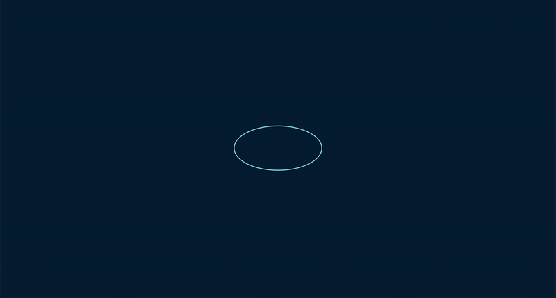
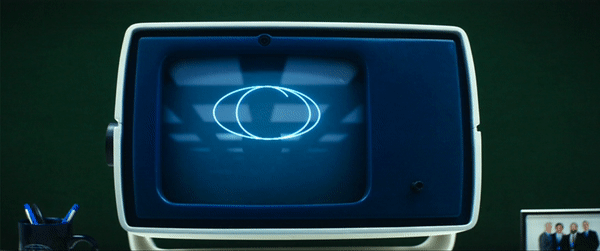
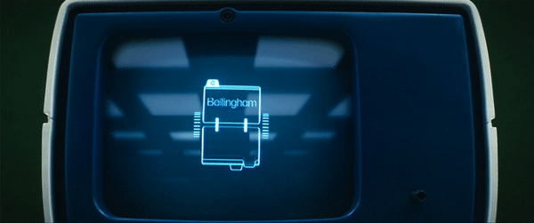
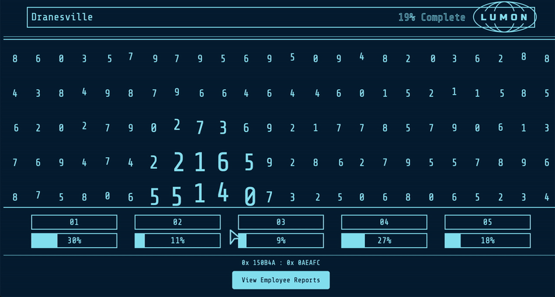

# Lumon Interface 

> **"Refinement is clarity. Compliance is contentment."**

Welcome to the **Lumon Interface**, an homage to the enigmatic world of *Severance*. This project replicates the retro-futuristic design of the Lumon workplace 👔 with a focus on precision and refinement 🗂️.

---

## 🔢 **Demo** 

Observe the meticulous design in action:



---


## **Examples from the show**

### **Design Inspiration**
The user interface pays homage to the iconic set piece from *Severance*, complete with retro-futuristic styling and meticulous detail.  


Lumon Screen from the show:



Screen Interface from the show:



---

## 👩🏻‍💻 **Overview**

The **Lumon Interface** is a static web-based simulation inspired by the aesthetics and functionality depicted in the show. It combines minimalist design with dynamic animations to create an immersive experience for all who dare to refine.

---

## 🌟 **Features**

- **Interactive Grid Display**:  
  A mesmerizing grid layout, dynamically populated with data for the ultimate refinement experience.

- **Dynamic Animations**:  
  Each element responds to user interactions, creating a lifelike sense of purpose and compliance.

- **Meticulous Design**:  
  Typography, colors, and layout adhere to the design principles of Lumon Industries—clean, sharp, and compliant.

---

## ⚒️ **Usage**

1. Clone the repository:
   ```bash
   git clone https://github.com/RJoshi141/lumon.git
   cd lumon
   ```

2. Open `index.html` in your preferred browser or serve the project locally:
   ```bash
   # If you have Live Server in VS Code
   Open with Live Server
   ```

3. Enjoy refining data, as every compliant worker should.

---

## ✍🏼 **Development Notes**

The current implementation focuses solely on the interface. Features like **Employee Reports** and the **Features Dashboard** are **under development** and will be introduced in future updates.

---

## 🚀 **Roadmap**

- Add a **Features Dashboard** with links to:
  - ✓ Employee Reports
  - Cryptic Message Board
  - Interactive Tasks
- ✓ Develop a dynamic **Employee Reports** module.
  - 
- Enhance user interactivity with additional animations and sound effects.

---

## 🗃️ **References**

This interface draws inspiration from the *Severance* universe and uses the following resources as references for its design and structure:
- [Severance UI Design](https://www.hudsandguis.com/home/2022/severance)
- Visuals and style inspired by the Apple TV+ series *Severance*.

---

## 🤝 **Contributions**

Contributions are welcome, but all code must meet Lumon’s exacting standards. Please ensure clarity, compliance, and refinement in every pull request.

---

## 📃 **License**

The **Lumon Interface** is an independent project inspired by the world of *Severance*. All rights to the show and its intellectual property belong to their respective owners.

---

Happy refining!


